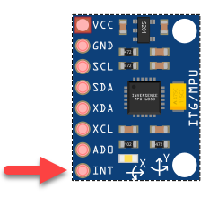

# MPU6050-Motion-Data
An efficient MPU6050 driver based on the [I<sup>2</sup>Cdevlib library](https://www.i2cdevlib.com/devices/mpu6050), providing fused orientation (quaternion), acceleration and rotational data via the on-device digital motion processor (DMP). Includes sensor offset calibration and raw unfused sensor data. This TypeScript module runs on Raspberry Pi 3 & 4. Communications with MPU6050 hardware is via I<sup>2</sup>C with the MPU6050 in the slave role. I<sup>2</sup>C communications is provided by the [rpio](https://www.npmjs.com/package/rpio) package.

# Contents
* [Prerequisites](#prerequisits)
* [Installation](#installation)
* [Quick Start](#quick-start)
* [Things to know](#things-to-know)
* [Using Digital Motion Processing](#using-digital-motion-processing-dmp)
* [Sensor Calibration](#sensor-calibration)
* [I<sup>2</sup>C Configuration](#i2c-configuration)
* [Hardware Interrupts](#hardware-interrupts)
* [Example](#example)

# Prerequisites
* Node 10+
* MPU6050 IC
* Raspberry Pi 3 or 4 with [I<sup>2</sup>C enabled](https://pimylifeup.com/raspberry-pi-i2c/)

# Installation
```
npm install @ros2jsguy/mpu6050-motion-data
```

# Quick Start

With your MPU6050 powered up and connected to a Raspiberry Pi or similar microcontroller (see circuit below), begin by importing this module's key TypeScript constructs.

```javascript
import {
  Data3D, MotionData, MPU6050, Utils 
} from '@ros2jsguy/mpu6050-motion-data';
```

Next create an instance of the `MPU6050` class to communicate with your 
MPU6050 chip via I<sup>2</sup>C.

```javascript
const imu = new MPU6050();
imu.initialize();

// use testConnection() to ensure the mpu6050 is working properly
console.log('Device connected:', imu.testConnection());
```

At this point motion data should be available from the chip. Here's how we access it:

```javascript
const motionData = imu.getMotionData();
// {
//   accel: {
//     x:   -56,
//     y:   128,
//     z: 16498
//   },
//   gyro {
//     x:   3,
//     y:   8
//     z: -21
//   },
// }
```

The MPU6050 class provides additional methods for accessing a subset of the motion data:
* getAccel()
* getGyro() 

# Things To Know
1. Always call MPU6050#initialize() before using new instances of the class.
```ts
let imu = new MPU6050();
imu.initialize();
```

2. The default I<sup>2</sup>C address is `0x68` and baud rate is `400000`. See [I<sup>2</sup>C Configuration](#i2c-configuration) to customize these settings.

3. The MPU6050 sensors must be calibrated before use. Do this by computing the accelerometer and gyroscope sensor offsets and applying them before use. See [Sensor Calibration](#sensor-calibration) for details.

4. Volatile Data
<br>Several of the MPU6050 class methods read and return data from the MPU605 device as a JavaScript Buffer. These buffers are volatile and should never be written to or accessed beyond the use of any method that reads from the MPU6050 device. 
```ts
let buf = imu.dmpGetCurrentFIFOPacket(); // buf data is valid
let data = imu.dmpGetMotionData(buf); // buf data still valid
imu.dmpPacketAvailable() // buf data invalid 
```

# Using Digital Motion Processing (DMP)

Where this library excels over other Nodejs MPU6050 drivers is its access to the MPU6050 Digital Motion Processing (DPU) Unit. The DPU performs complex sensor fusion computation directly on the MPU6050 which can greatly improve the performance of your application. 

Note that use of DMP is optional.  

When DMP is enabled the MPU6050 is configured as follows:
* DMP runs at 200 Hz
* Sensor data is output to the FIFO
* The FSYNC/INT pin has a 50 us pulse sent every 5 ms to indicate data is available
* Clock Source = X-Gyro
* Accelerometer Full-scale Range = 2g
* Gyroscope Full-scale Range = +-2000 deg/sec
* DMP Raw Data Interrupt is enabled
* Interrupt is cleared on any read
* Rate divider = 4


The MPU6050 class `dmpInitialize()` method uploads the [InvenSense Motion Driver v6.12](https://www.digikey.com/en/pdf/i/invensense/motion-driver-6-1-user-guide) image to the DMP. The DMP then continuously produces fused sensor data stored into FIFO memory.


# Sensor Calibration
MPU6050-Motion-Data provides the *calibrate* script and an api for calculating and loading the MPU6050 accelerometer and gyro sensor offsets used by the DMP.

To use the calibrate utility, open a terminal on your Raspberry Pi with current working directory (cwd) in your Nodejs project for which @ros2jsguy/mpu6050-motion-data has been added as a dependency. 

Next run the following command:
```shell
sudo npx calibrate

//           X Accel  Y Accel  Z Accel   X Gyro   Y Gyro   Z Gyro
//OFFSETS      -4470    -1753     2100       94      129      145

```
The utility outputs the accelerometer and gyroscope offsets for future use with the `mpu6050.setSensorOffsets()` method.

```javascript
// example
mpu6050.setSensorOffsets(-4470, -1753, 2100, 94, 129, 145);
```

Alternatively you can use the mpu6050 api as shown below to dynamically compute offsets during your application's initialization.

```javascript
mpu6050.calibrateAccel();
mpu6050.calibrateGyro();
```


# Hardware Interrupts
The MPU6050 can be configured to generate an interrupt signal on the INT pin when data is ready. The INT pin has two modes for signalling a data-ready event.



The default mode is to apply a 50 us active state pulse on the INT pin. The default active state is HIGH. Alternatively, the interrupt system can be programmed to set the INT pin to its active state when data is ready and to remain active until the interrupt is cleared. This is known as the "latch" mode.

```javascript
// enable latch signaling mode on the INT pin 
setInterruptLatchEnabled(true);
```

The data-ready interrupt is cleared by either directly reading the data-ready interrupt register or by configuring the interrupt system to automatically clear the data-ready interrupt when any register is read.

Internally the "onoff" GPIO library is used for polling GPIO pins for state changes. This library lacks the polling resolution to consistently detect the 50 us active state pulses of the default INT pin signaling mode. Therefore, the "latch" mode is recommended for 

```javascript
// Data-ready interrupt is cleared only when reading 
// the data-ready interrupt 
setInterruptClearMode(0);

// Clear the data-ready interrupt on any data read
setInterruptClearMode(1);
```

# I<sup>2</sup>C Configuration Options
The MPU6050 class constructor can accept an optional `I2COptions` parameter for specifying the I<sup>2</sup>C address and baud rate for communicating with the MPU6050 chip.

The default I<sup>2</sup>COptions are:
```javascript
{
  i2cAddress: 0x68,
  baudRate: 400000
}
```

Here is an example using the alternate MPU6050 I<sup>2</sup>C address.

```javascript
new MPU6050({i2cAddress: 0x69});
```


# Example
In this example a Raspberry Pi 4 communicates with a MPU6050 on a low cost [GY-521 breakout board](https://www.amazon.com/gp/product/B01DK83ZYQ) via I<sup>2</sup>C. The MPU6050 operates in I<sup>2</sup>C slave mode with a default I<sup>2</sup>C address of `0x68`. Note the orientation markings of your breakout board for alignment with the data output in the following example.

The wiring is simple with the GY-521 board powered directly from the 3.3V output of the RPI. 


Note you must enable I<sup>2</sup>C on your RPI device as it is typically not enabled by default. Additionally you may need to run in `sudo` mode.

*I set up this example with I<sup>2</sup>C enabled on my RPI running Ubuntu 20.4 and node 12.*

```shell
tsc <your-example.ts>
sudo node <your-example.js>
```

TypeScript example code:
```javascript
import { MPU6050} from "../mpu6050";
import { Utils } from "../utils";
import { InterruptMonitor } from "../interrupt-monitor";

const GPIO_MPU6050_DATA_PIN = 18;

function main() {
  let interrupts = 0;

  const imu = new MPU6050();
  imu.initialize();
  
  console.log('MPU6050 Device')
  console.log('       connected: ', imu.testConnection());
  console.log('              id: ', imu.getDeviceID());
  console.log('  temperature(F): ', Utils.celciusToF(imu.getTemperature()).toFixed(2));
  Utils.msleep(500);

  console.log('\nDMP initialize and calibrate...');
  imu.dmpInitialize();

  // calibrate sensors
  imu.calibrateAccel();
  imu.calibrateGyro();
  imu.printActiveOffsets();

  // setup interrupt
  imu.setInterruptLatchEnabled(true);
  imu.setInterruptDMPEnabled(true);

  // setup interrupt event monitoring and handling
  const interruptMonitor = new InterruptMonitor(GPIO_MPU6050_DATA_PIN);
  interruptMonitor.on('data', () => {
      if (++interrupts === 1) console.log('  Receiving interrupt(s)');
      const buf = imu.dmpGetCurrentFIFOPacket();
      if (buf) {
        const data = imu.dmpGetMotionData(buf);
        console.log(data);
      }
  });
  interruptMonitor.on('error', (error: Error) => {
    console.log('Data error:', error.message);
  });
  interruptMonitor.start();

  // run for 10 seconds then shutdown process
  setTimeout(()=>{
    imu.shutdown();
    interruptMonitor.shutdown();
    
    process.exit(0);
  }, 10000);

  console.log('\nSampling data for 10 seconds');
  imu.setDMPEnabled(true); // start DMP, data-ready interrupts should be raised
  console.log('  Waiting for interrupts');
}

main();
```

# Resources
1. [MPU-6050 Specification Datasheet](https://www.digikey.com/en/datasheets/tdk-invensense/tdk-invensense-rm-mpu-6000a)
2. [MPU-6050 Register Map and Descriptions](https://www.digikey.com/en/datasheets/tdk-invensense/tdk-invensense-rm-mpu-6000a)
3. [Motion Driver 6.1 - User Guide](https://www.digikey.com/en/pdf/i/invensense/motion-driver-6-1-user-guide)
4. [mpu6050 Arduino Library Github repo by Electronic Cats](https://github.com/ElectronicCats/mpu6050)
5. [I<sup>2</sup>Cdevlib MPU6050 library](https://www.i2cdevlib.com/devices/mpu6050)

# Credits
MPU6050-Motion-Data is mostly a direct TypeScript translation of the I<sup>2</sup>Cdevlib MPU6050 Arduino library. Thus all credit goes to it's principle author, Jeff Rowberg.

# Contributions
All assistance welcome. Please fork this repo, make your proposed changes and submit as a PR. 

