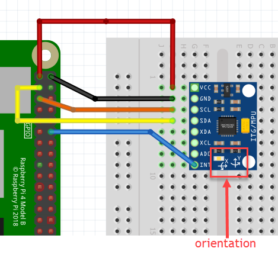

# MPU6050-Motion-Data
An efficient MPU6050 driver based on the [I2Cdevlib library](https://www.i2cdevlib.com/devices/mpu6050), providing fused orientation (quaternion), acceleration and rotational data via the on-device digital motion processor (DMP). Includes sensor offset calibration and raw unfused sensor data. This module is implemented in TypeScript and runs on Raspberry Pi 3 & 4. Communications with MPU6050 hardware is via I2C with the 6050 in the slave role. I2C communications is provided by the [rpio](https://www.npmjs.com/package/rpio) package.

# Prerequisites
* Node 10+
* Raspberry Pi 3 or 4 with [I2C enabled](https://pimylifeup.com/raspberry-pi-i2c/)

# Installation
```
npm install @ros2jsguy/mpu6050-motion-data
```
## Digital Motion Processing
Where this package excels over other Nodejs MPU6050 drivers is its access to the MPU6050 Digital Motion Processing (DPU) Unit. The DPU performs complex sensor fusion computation directly on the MPU6050. This can improve the performance of your application. 

The MPU6050 class `initialize()` method uploads the [InvenSense Motion Driver v6.12](https://www.digikey.com/en/pdf/i/invensense/motion-driver-6-1-user-guide) image to the DMP. The DMP then continuously produces fused sensor data stored into FIFO memory.

## Sensor Calibration
MPU6050-Motion-Data enables you to calculate and load the MPU6050 accelerometer and gyro sensor offsets used by the DMP. You can update the DMP's sensor offsets manually or automatically.

# Example
In this example a Raspberry Pi 4 communicates with a MPU6050 on a low cost [GY-521 breakout board](https://www.amazon.com/gp/product/B01DK83ZYQ) via I2C. The MPU6050 operates is in I2C slave mode with a default I2C address of `0x68`. Note the orientation markings of your breakout board for alignment with the data output in the following example.

The wiring is simple with the GY-521 board powered directly from the 3.3V output of the RPI. 



Note you must enable I2C on your RPI device as it is typically not enabled by default. Additionally you may need to run in `sudo`.

*I set up this example with I2C enabled on my RPI running Ubuntu 20.4 and node 12.*

```
tsc <your-example.ts>
sudo node <you-example.js>
```

TypeScript example code:
```ts
import { MPU6050, Gyro, Accel, Quaternion, Vector3 } from '@ros2jsguy/mpu6050-motion-data';
import {Utils} from '../utils';

function main() {

  const imu = new MPU6050();
  imu.initialize();
  
  console.log('Device connected:', imu.testConnection());
  console.log('DeviceId:', imu.getDeviceID());

  console.log('Uncalibrated Device Offsets')
  console.log('XAOffset:', imu.getXAccelOffset());
  console.log('YAOffset:', imu.getYAccelOffset());
  console.log('ZAOffset:', imu.getZAccelOffset());
  console.log('XGOffset:', imu.getXGyroOffset());
  console.log('YGOffset:', imu.getYGyroOffset());
  console.log('ZGOffset:', imu.getZGyroOffset());
  
  console.log();
  console.log('Sample data without calibration');
  for (let i=0; i < 3; i++) {
    console.log('motion data:', imu.getMotionData());
    Utils.msleep(500); // 500 millis
  }

  console.log('Initialize DMP...');
  imu.dmpInitialize();
  imu.calibrateAccel(6);
  imu.calibrateGyro(6);
  imu.printActiveOffsets();
  imu.setDMPEnabled(true);

  console.log();
  console.log('Calibrated Device Offsets');
  console.log('XAOffset:', imu.getXAccelOffset());
  console.log('YAOffset:', imu.getYAccelOffset());
  console.log('ZAOffset:', imu.getZAccelOffset());
  console.log('XGOffset:', imu.getXGyroOffset());
  console.log('YGOffset:', imu.getYGyroOffset());
  console.log('ZGOffset:', imu.getZGyroOffset());

  console.log();
  console.log('Sample data with DMP enabled');
  for (let i=0; i < 3; i++) {
    console.log('data:', imu.getMotionData());
    Utils.msleep(500); // 500 millis
  }

  console.log();
  console.log('DMP packet data');
  // loop until a full FIFO packet is available
  for (let i=0; i < 100; i++) {
    const buf = imu.dmpGetCurrentFIFOPacket();
    if (!buf) continue;

    const gyro = imu.dmpGetGyro(buf);
    const accel = imu.dmpGetAccel(buf);
    const quaternion = imu.dmpGetQuaternion(buf);
    quaternion.w /= 16384;
    const euler = imu.dmpGetEuler(quaternion);
    const gravity = imu.dmpGetGravity(buf);
    const linearAccel = imu.dmpGetLinearAccel(accel, gravity);
    const rpy = imu.dmpGetYawPitchRoll(quaternion, gravity);

    console.log('  dmpGyro:', gyro);
    console.log('  dmpAccel:', accel);
    console.log('  dmpQuaternion:', quaternion);
    console.log('  dmpEuler:', euler.phi, euler.theta, euler.psi);
    console.log('  dmpGravity:', gravity.x, gravity.y, gravity.z);
    console.log('  dmpRPY ', 
      ' roll:', rpy.roll * 180 / Math.PI, 
      ' pitch:', rpy.pitch * 180 / Math.PI, 
      ' yaw:', rpy.yaw * 180 / Math.PI);
    
    // packet received and processed. Now exit loop.
    break;
  }

  console.log();
  console.log('Complete');
}

function rad2degree(rads: number, fixed = 0) {
  const deg = rads * 180 / Math.PI;
  return fixed > 0 ? deg.toFixed(fixed) : deg;
}

main();

```

# Resources
1. [MPU-6050 Specification Datasheet](https://www.digikey.com/en/datasheets/tdk-invensense/tdk-invensense-rm-mpu-6000a)
2. [MPU-6050 Register Map and Descriptions](https://www.digikey.com/en/datasheets/tdk-invensense/tdk-invensense-rm-mpu-6000a)
3. [Motion Driver 6.1 - User Guide](https://www.digikey.com/en/pdf/i/invensense/motion-driver-6-1-user-guide)
4. [mpu6050 Arduino Library Github repo by Electronic Cats](https://github.com/ElectronicCats/mpu6050)
5. [I2Cdevlib MPU6050 library](https://www.i2cdevlib.com/devices/mpu6050)

# Credits
MPU6050-Motion-Data is mostly a direct TypeScript translation of the I2Cdevlibe MPU6050 Arduino library. Thus all credit goes to it's principle author, Jeff Rowberg.

# Contributions
All assistance welcome. Please fork this repo, make your proposed changes and submit as a PR. 

